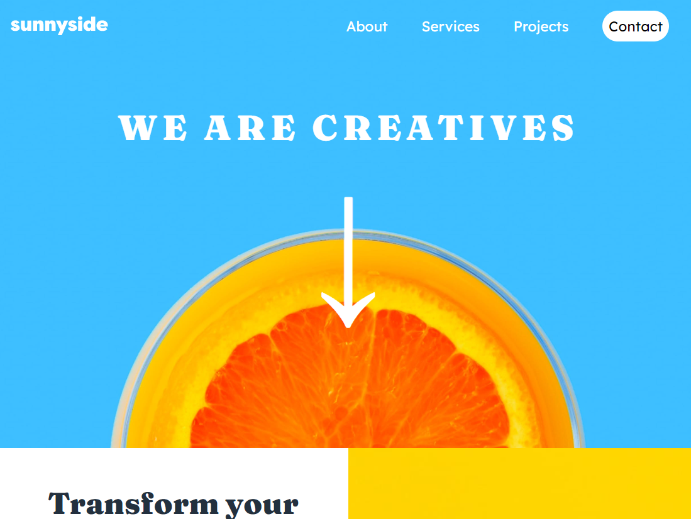

# Frontend Mentor - NFT preview card component solution
 This is a solution to the [NFT preview card component challenge](https://www.frontendmentor.io/challenges/nft-preview-card-component-SbdUL_w0U) on [Frontend Mentor](https://www.frontendmentor.io/). Frontend Mentor challenges help you improve your coding skills by building realistic projects.Frontend Mentor - NFT preview card component solution

## Overview

- [Overview](#overview)
  - [The challenge](#the-challenge)
  - [Screenshot](#screenshot)
  - [Links](#links)

- [Author](#author)

### The challenge
  Users should be able to:
- View the optimal layout depending on their device's screen size
- See hover states for interactive elements

### Screenshot

### Links

- Solution URL: [Here is my solution](https://github.com/mklestil/nft-preview-card-component)
- Live Site URL: [Here is my live solution](https://mklestil.github.io/nft-preview-card-component/)

### Built with

- Semantic HTML5 markup
- CSS, Sass
- Flexbox, Grid
- Mobile-first workflow

## Author

- Website - [Martin Klestil](https://github.com/mklestil)
- Frontend Mentor - [@mklestil](https://www.frontendmentor.io/profile/mklestil)
- Twitter - [@mklestil](https://twitter.com/MKlestil)