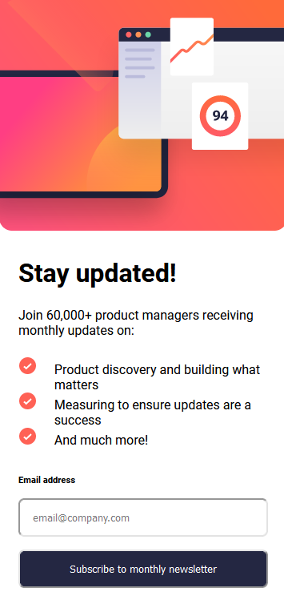

# Frontend Mentor Challenges
 Here are my solutions for [Frontend Mentor](https://www.frontendmentor.io/) projects. 
 Frontend Mentor challenges help you improve your coding skills by building realistic projects.

## Overview

- [Overview](#overview)
  - [The projects](#the-projects)
  - [Screenshot](#screenshot)
  - [Links](#links)

- [Author](#author)

### The projects
- newsletter signup form
- nft preview card component
- stats-preview-card-component
- sunnyside-agency-landing-page

### Screenshot

### Links

[Frontend Mentor](https://www.frontendmentor.io/)

[Overview]([https://www.frontendmentor.io/](https://mklestil.github.io/frontend-mentor-challenges/))
[Sunnyside]([https://www.frontendmentor.io/](https://mklestil.github.io/frontend-mentor-challenges/sunnyside-agency-landing-page/index.html))
[Stats preview card]([https://www.frontendmentor.io/](https://mklestil.github.io/frontend-mentor-challenges/stats-preview-card-component/index.html))
[nft preview card]([https://www.frontendmentor.io/](https://mklestil.github.io/frontend-mentor-challenges/nft-preview-card-component/index.html))
[newsletter]([https://www.frontendmentor.io/](https://mklestil.github.io/frontend-mentor-challenges/newsletter-signup-form/index.html))

### Built with

- Semantic HTML5 markup
- CSS, Sass
- Flexbox, Grid
- Mobile-first workflow
- JavaScript

## Author TintilDev
- Website - [TintilDev](https://github.com/tintildev)
- Frontend Mentor - [Tintildev](https://www.frontendmentor.io/profile/tintildev)
- Bluesky - [@tintildev‬](https://bsky.app/profile/tintildev.bsky.social)
- LinkedIn - [Martin Klestil](https://www.linkedin.com/in/martin-klestil/)
- Dev.to [TintilDev](https://dev.to/tintildev)

